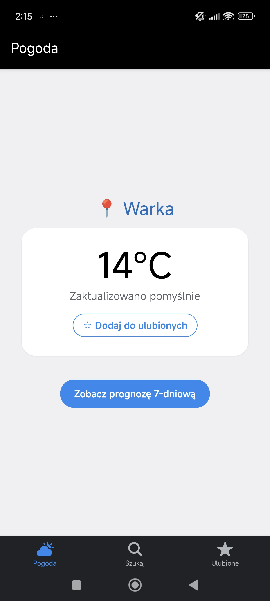
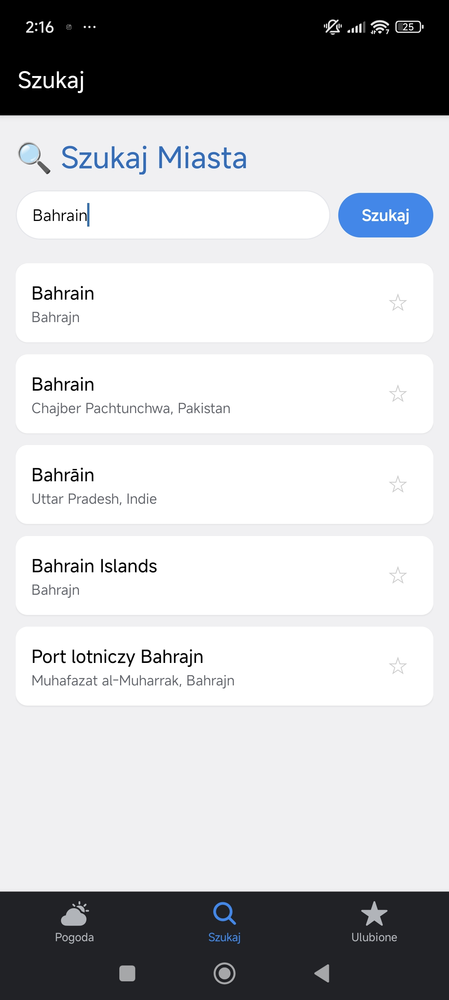
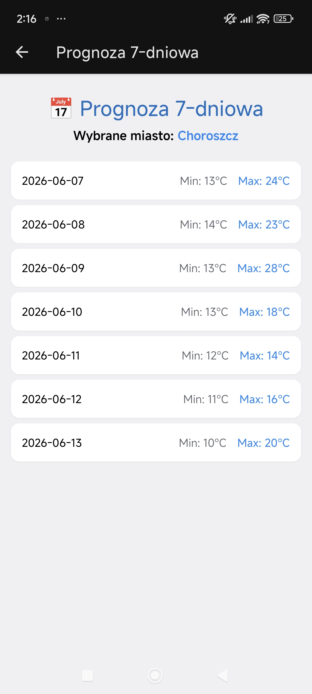
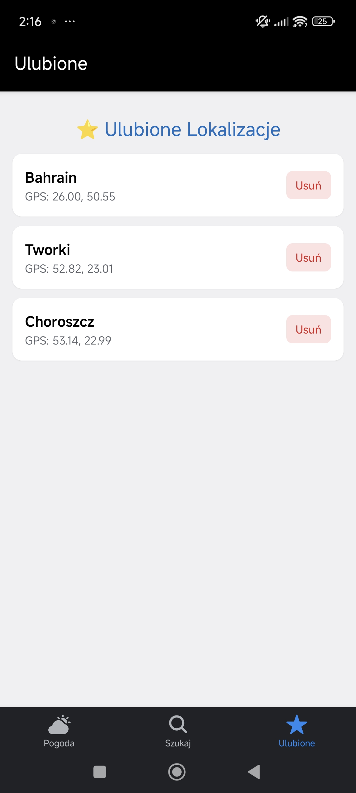

# WeatherNow
## Aplikacja Pogodowa

Aplikacja mobilna stworzona w środowisku **React Native (Expo SDK 54)** przy użyciu języka **TypeScript** oraz stylizowana za pomocą **NativeWind (Tailwind CSS)**.

| Ekran Główny (GPS) | Wyszukiwarka miast | Prognoza 7-dniowa | Ulubione |
| :---: | :---: | :---: | :---: |
|  |  |  |  |

---

## Jak uruchomić aplikację

1. **Sklonuj repozytorium i wejdź do folderu:**
   Otwórz wiersz poleceń (CMD), przejdź do folderu, w którym chcesz zainstalować program, a następnie wykonaj komendy:

```bash
   git clone <LINK_DO_TWOJEGO_REPOZYTORIUM>
   cd jezyki-expo
   ```

2. **Zainstaluj wszystkie wymagane zależności:**
Skorzystaj z polecenia:

```bash
   npm install
   ```

3. **Uruchom serwer Metro:**
Skorzystaj z polecenia:

```bash
   npx expo start
   ```

Po uruchomieniu serwera wyskoczy kod QR. Zeskanuj go na swoim telefonie przez aplikację **Expo Go**. Zarówno telefon, jak i komputer muszą być w tej samej sieci Wi-Fi.

**Rozwiązywanie problemów:** Jeżeli aplikacja nie ładuje się na telefonie, spróbuj wejść we właściwości sieci na swoim komputerze i przestaw **Profil sieciowy** z *Publiczny* na *Prywatny*.

---

## Użyte technologie

* **Środowisko bazowe:** React Native + Expo (SDK 54) — uniwersalny framework do budowania natywnych aplikacji na Androida i iOS z jednego kodu źródłowego.
* **Język programowania:** TypeScript — silne typowanie danych gwarantujące stabilność i eliminację błędów w czasie kompilacji.
* **Zarządzanie stanem globalnym:** Zustand — lekki i wydajny menedżer stanu oparty na hookach, wybrany w celu optymalizacji re-renderów i uniknięcia nadmiaru kodu konfiguracyjnego.
* **Nawigacja:** Expo Router — nowoczesny, plikowy system routingu automatyzujący zarządzanie ekranami i ułatwiający przekazywanie parametrów.
* **Stylizowanie:** NativeWind (Tailwind CSS) — system klas narzędziowych zapewniający błyskawiczne i ujednolicone stylowanie komponentów.
* **Warstwa offline & Cache:** NetInfo — asynchroniczne monitorowanie stanu sieci na żywo.
* **Baza danych:** AsyncStorage — lokalna, trwała pamięć typu klucz-wartość do przechowywania ulubionych miast oraz pamięci podręcznej dla trybu offline.
* **Transpiler:** Babel — zapewnia wsteczną kompatybilność kodu oraz kompilację stylów NativeWind.
* **Środowisko testowe:** Jest — framework do automatycznych testów jednostkowych (aplikacja posiada 8 testów pokrywających logikę biznesową sklepu).

---

## Zależności Główne (Production Dependencies)

* **`expo`** (SDK 54) — Rdzeń platformy uruchomieniowej.
* **`expo-router`** — Odpowiada za plikową nawigację między ekranami aplikacji.
* **`expo-location`** — Odpowiada za natywny dostęp do modułu GPS w telefonie.
* **`zustand`** — Centralny magazyn stanu aplikacji (zarządzanie pamięcią podręczną i ulubionymi).
* **`nativewind`** — Silnik mapujący klasy Tailwind CSS na natywne style platform mobilnych.
* **`@react-native-async-storage/async-storage`** — Lokalna baza danych klucz-wartość na dysku urządzenia.
* **`@react-native-community/netinfo`** — Moduł monitorujący stan połączenia sieciowego.

### Zależności Deweloperskie (Development Dependencies)

* **`typescript`** — Kompilator i strażnik statycznego typowania kodu.
* **`tailwindcss`** — Narzędzie dostarczające klasy stylów dla NativeWind w czasie dewelopmentu.
* **`jest`** i **`jest-expo`** — Środowisko uruchomieniowe do automatycznego wykonywania testów jednostkowych sklepu pogodowego.
* **`@babel/core`** — Transpiler kodu odpowiedzialny za kompatybilność wsteczną.

---

## Funkcjonalność

* Sprawdzenie pogody miejsca, w którym się aktualnie znajdujemy poprzez sygnał GPS.
* Sprawdzenie 7-dniowej prognozy pogody.
* Możliwość znalezienia dowolnego miasta i sprawdzenia jego 7-dniowej prognozy pogody.
* Możliwość dodania miast do ulubionych, przez co szybko można sprawdzić w nich 7-dniową prognozę pogody.
